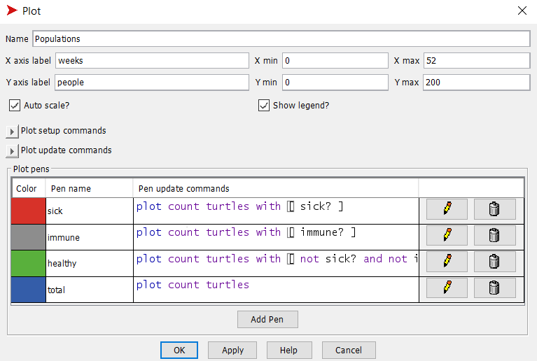
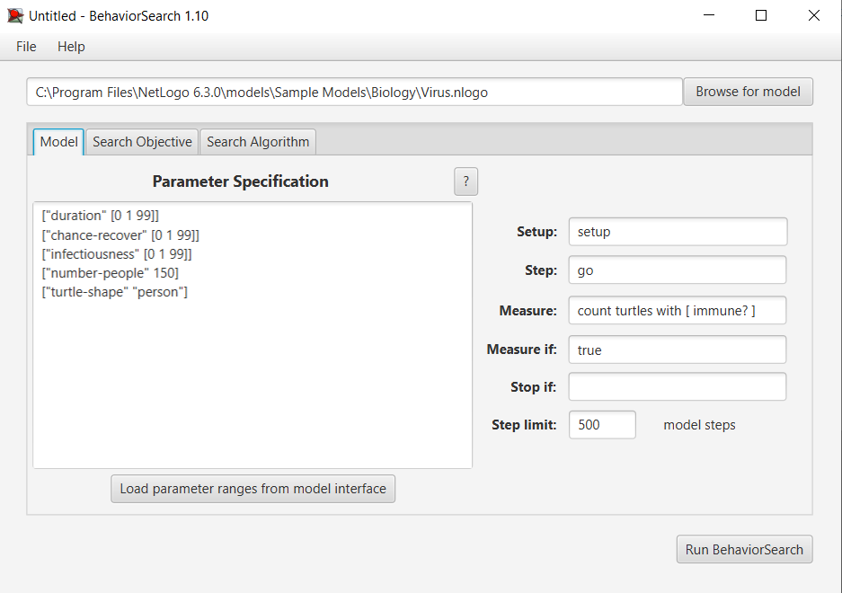
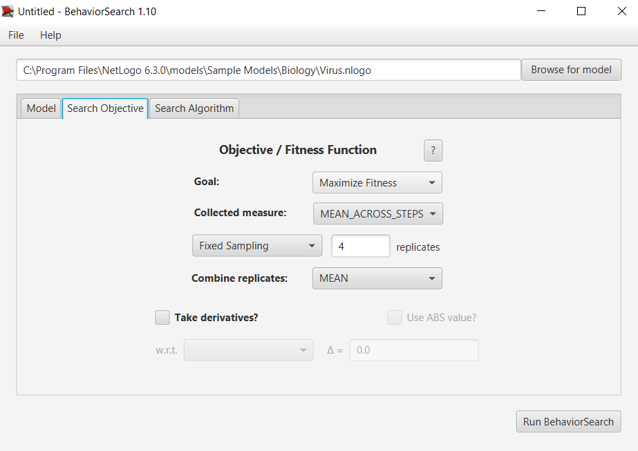
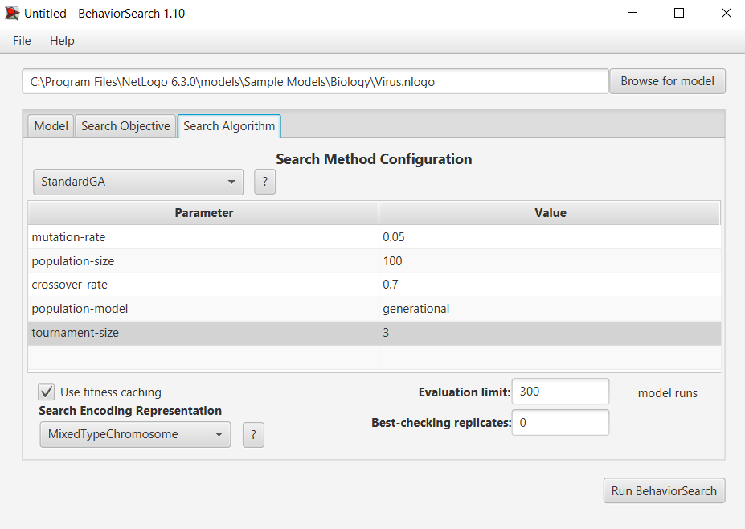
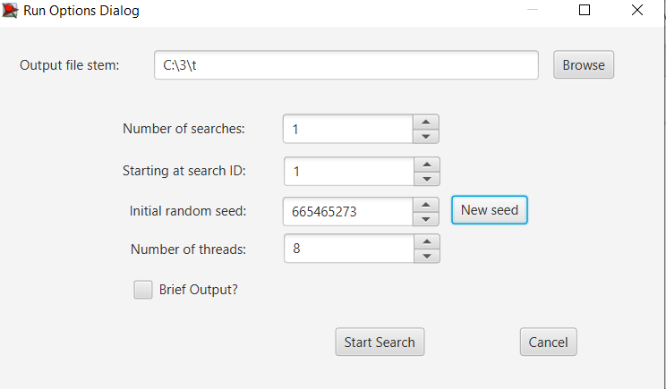
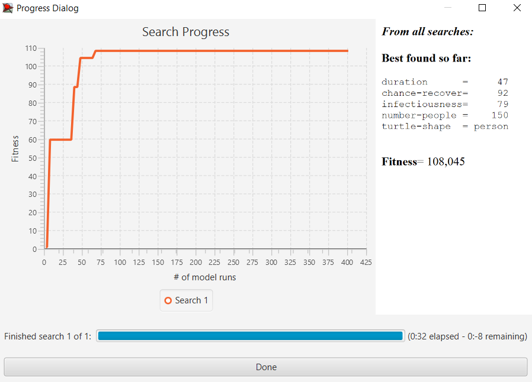
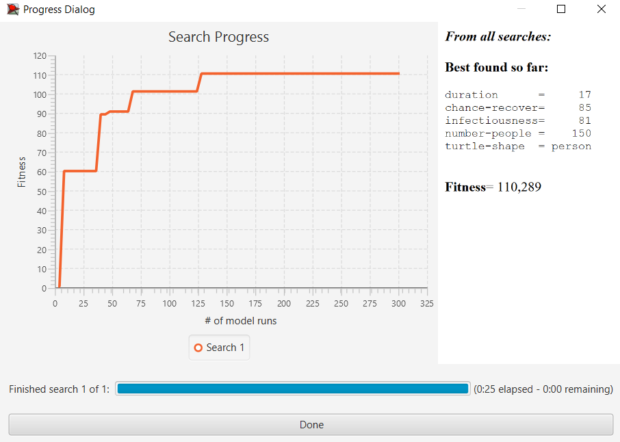

## Комп'ютерні системи імітаційного моделювання
## СПм-22-4, **Гайдай Ярослав Андрійович**
### Лабораторна робота №**3**. Використання засобів обчислювального інтелекту для оптимізації імітаційних моделей

 

### Варіант 3, модель у середовищі NetLogo:
[Virus](https://www.netlogoweb.org/launch#https://www.netlogoweb.org/assets/modelslib/Sample%20Models/Biology/Virus.nlogo)

 

#### Вербальний опис моделі:

- https://github.com/SuchABadCoder/CSIM_1

### Налаштування середовища BehaviorSearch:

**Обрана модель**:
<pre>
C:\Program Files\NetLogo 6.3.0\models\Sample Models\Biology\Virus.nlogo
</pre>

**Параметри моделі** (вкладка Model):  
<pre>
["duration" [0 1 99]]
["chance-recover" [0 1 99]]
["infectiousness" [0 1 99]]
["number-people" 150]
["turtle-shape" "person"]
</pre>

Для фітнес-функції було обрано **кількість людей з імунітетом**, вираз для її розрахунку взято з налаштувань графіка **Populations** аналізованої імітаційної моделі в середовищі NetLogo:

та вказано у параметрі "**Measure**":
<pre>
count turtles with [ immune? ]
</pre>

Кількість людей у популяції з імунітетом має розраховуватись **в середньому** за весь період симуляції тривалістю 500 тактів, адже на кожному такті є своє значення кількості, починаючи з 0 такту симуляції.
Параметр "**Mesure if**" встановлено зі значенням true. Параметр зупинки за умовою ("**Stop if**") не використовувався. 
Загальний вигляд вкладки налаштувань параметрів моделі:  

**Налаштування цільової функції** (вкладка Search Objective):  
Метою підбору параметрів імітаційної моделі для визначення значення "**кількості людей з імунітетом**" є **Максимізація** цього показника через параметр "**Goal**" зі значенням "**Maximize Fitness**". Тобто, потрібно визначити такі параметри, коли максимальна кількість людей в популяції має імунітет до вірусу.
Для досягнення цієї мети, використовується параметр "**Collected measure**", що визначає спосіб обліку цього показника. У цьому випадку, встановлено значення "**MEAN_ACROSS_STEPS**". Це означає, що цікавить не просто значення "**кількості людей з імунітетом**" в певний момент симуляції, а середнє значення цього показника за весь час проведення симуляції. Щоб уникнути викривлення результатів через випадкові значення, що використовуються в логіці самої імітаційної моделі, кожна симуляція проводиться **4 рази**, результуюче значення розраховується як **середнє арифметичне**. Це допомагає зменшити випадкові відхилення і забезпечити більш надійний результат.
Загальний вигляд вкладки налаштувань цільової функції: 

**Налаштування алгоритму пошуку** (вкладка Search Algorithm):  

Загальний вид вкладки налаштувань алгоритму пошуку:  

 

### Результати використання BehaviorSearch:
Діалогове вікно запуску пошуку :  

Результат пошуку параметрів імітаційної моделі, використовуючи **генетичний алгоритм**:  

Результат пошуку параметрів імітаційної моделі, використовуючи **випадковий пошук**:  

